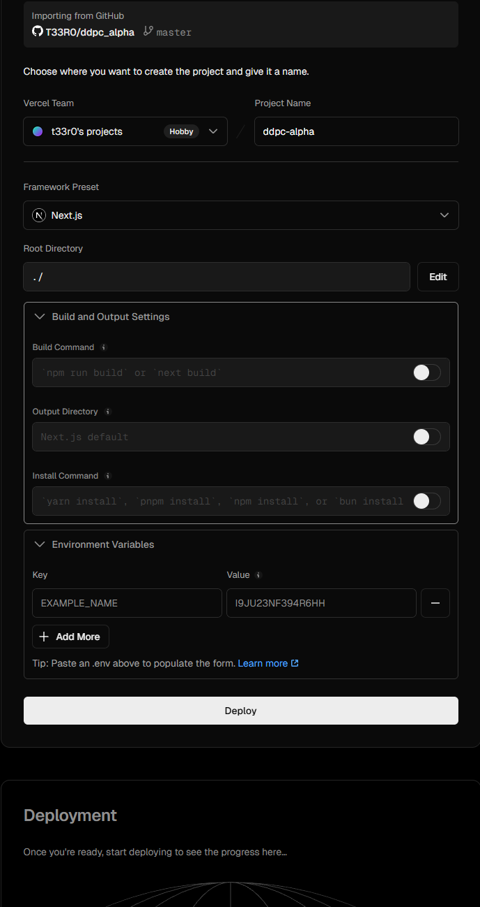
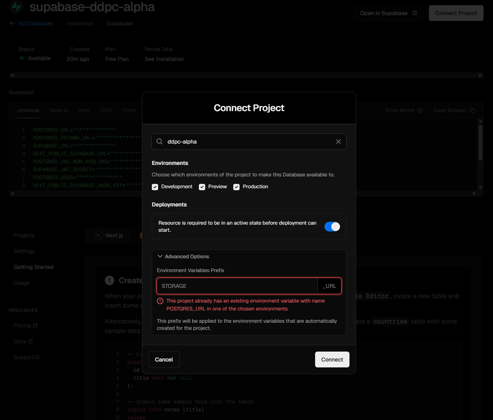

This is a [Next.js](https://nextjs.org) project bootstrapped with [`create-next-app`](https://nextjs.org/docs/app/api-reference/cli/create-next-app).

## Getting Started

## Analytics (v0)

We added lightweight, value-visible analytics:

- SummaryChips on `vehicles` list and vehicle overview show:
  - Upcoming tasks count: number of `work_item` with status PLANNED or IN_PROGRESS
  - Last service date: most recent `event` with type SERVICE
  - 30‑day events: count of `event` in the last 30 days

Server components batch-fetch aggregates to avoid N+1 queries. No schema changes.

Screenshots:




First, run the development server:

```bash
npm run dev
# or
yarn dev
# or
pnpm dev
# or
bun dev
```

Open [http://localhost:3000](http://localhost:3000) with your browser to see the result.

You can start editing the page by modifying `app/page.tsx`. The page auto-updates as you edit the file.

This project uses [`next/font`](https://nextjs.org/docs/app/building-your-application/optimizing/fonts) to automatically optimize and load [Geist](https://vercel.com/font), a new font family for Vercel.

## Learn More

To learn more about Next.js, take a look at the following resources:

- [Next.js Documentation](https://nextjs.org/docs) - learn about Next.js features and API.
- [Learn Next.js](https://nextjs.org/learn) - an interactive Next.js tutorial.

You can check out [the Next.js GitHub repository](https://github.com/vercel/next.js) - your feedback and contributions are welcome!

## Deploy on Vercel

The easiest way to deploy your Next.js app is to use the [Vercel Platform](https://vercel.com/new?utm_medium=default-template&filter=next.js&utm_source=create-next-app&utm_campaign=create-next-app-readme) from the creators of Next.js.

Check out our [Next.js deployment documentation](https://nextjs.org/docs/app/building-your-application/deploying) for more details.

---

# DDPC Alpha (Next.js + Supabase)

This is the alpha for the "GitHub for Automobiles" app. It uses Next.js App Router and Supabase (Auth, Postgres, Storage).

## Environment Setup

- Copy `env.sample` to `.env.local` and set values:

```
NEXT_PUBLIC_SUPABASE_URL=
NEXT_PUBLIC_SUPABASE_ANON_KEY=
```

- Supabase Auth settings:
  - Enable Email (magic link)
  - (Optional) Enable Google OAuth; add redirect URLs:
    - `http://localhost:3000`
    - `https://<your-vercel-domain>.vercel.app`

- Supabase Storage:
  - Create a public bucket, e.g., `vehicle-media` (if images are used)

### Required Environment Variables

Set these in `.env.local` (local) and in Vercel Project Settings (Preview/Prod):

```
NEXT_PUBLIC_SUPABASE_URL=your_supabase_url
NEXT_PUBLIC_SUPABASE_ANON_KEY=your_supabase_anon_key
```

## Run locally

```
npm install
npm run dev
# http://localhost:3000
```

## Deploy to Vercel

1) Import this repo in Vercel (New Project). Use defaults for a Next.js app.

2) Add Project Environment Variables (Project → Settings → Environment Variables):
   - `NEXT_PUBLIC_SUPABASE_URL`
   - `NEXT_PUBLIC_SUPABASE_ANON_KEY`

3) Supabase Auth → URL configuration:
   - Site URL: `https://<your-vercel-domain>.vercel.app`
   - Additional Redirect URLs: include both local and Vercel URL

4) Verify in production:
   - Sign-in (email/Google)
   - Vehicles CRUD and image upload
   - Tasks board: create with tags/due, drag-and-drop, delete
   - Timeline: create, filter, group by month, delete

## Seed the Database

After authenticating at least once (so your user exists), run the seed to create a demo garage, vehicle, and tasks.

1) Open Supabase SQL Editor.
2) Paste and run the contents of `db/schema.sql` to ensure tables and policies are present.
3) Paste and run `supabase/seed.sql` (it uses the current user's UID for ownership).

Re-run the seed whenever needed to reset demo content.

## Row-Level Security (RLS) Summary

- Owner/members can read/write vehicles, tasks, and events via membership checks.
- Public vehicle page: anyone can read vehicles with `privacy = 'PUBLIC'`.
- Events: a dedicated SELECT policy allows reading events of PUBLIC vehicles; the app sanitizes the projection (no cost/odometer/invoices on public pages).
- Storage: public bucket `vehicle-media` for vehicle photos with public read; authenticated users can manage their own uploads.

Policies are defined in `db/schema.sql`. Apply them via the Supabase SQL Editor.

## Storage Bucket Setup + Policy SQL

Create a public bucket and apply policies (if not using the defaults above):

```sql
insert into storage.buckets (id, name, public)
values ('vehicle-media', 'vehicle-media', true)
on conflict (id) do nothing;

-- Public read
create policy if not exists "public read vehicle-media"
on storage.objects
for select
using (
  bucket_id = 'vehicle-media'
);

-- Authenticated insert/update/delete own
create policy if not exists "auth insert own vehicle-media" on storage.objects for insert to authenticated with check (
  bucket_id = 'vehicle-media' and owner = auth.uid()
);
create policy if not exists "auth update own vehicle-media" on storage.objects for update to authenticated using (
  bucket_id = 'vehicle-media' and owner = auth.uid()
) with check (
  bucket_id = 'vehicle-media' and owner = auth.uid()
);
create policy if not exists "auth delete own vehicle-media" on storage.objects for delete to authenticated using (
  bucket_id = 'vehicle-media' and owner = auth.uid()
);
```

## Screenshots (Happy Path)

Add or update screenshots under `media/screenshots/` and reference them here:

- Sign-in view
- Vehicles list with edit controls
- Tasks Kanban board
- Timeline with quick-add and filters
- Public vehicle page

## Storage Setup (images)

This app expects a public Storage bucket named `vehicle-media` for vehicle photos. Create it and add simple RLS policies.

1) Create the bucket (public):

```sql
insert into storage.buckets (id, name, public)
values ('vehicle-media', 'vehicle-media', true)
on conflict (id) do nothing;
```

2) Policies:

```sql
-- Public read
create policy "public read vehicle-media"
on storage.objects
for select
using (
  bucket_id = 'vehicle-media'
);

-- Authenticated insert (owner is uploader)
create policy "auth insert own vehicle-media"
on storage.objects
for insert
to authenticated
with check (
  bucket_id = 'vehicle-media'
  and owner = auth.uid()
);

-- Authenticated update own
create policy "auth update own vehicle-media"
on storage.objects
for update
to authenticated
using (
  bucket_id = 'vehicle-media' and owner = auth.uid()
)
with check (
  bucket_id = 'vehicle-media' and owner = auth.uid()
);

-- Authenticated delete own
create policy "auth delete own vehicle-media"
on storage.objects
for delete
to authenticated
using (
  bucket_id = 'vehicle-media' and owner = auth.uid()
);
```

Now uploads from the UI will succeed and images will be publicly viewable via `getPublicUrl`.

## Notes

- `.env.local` should not be committed. Use `env.sample` to share required keys.
- Next.js/Tailwind/React versions are pinned in `package.json`.
